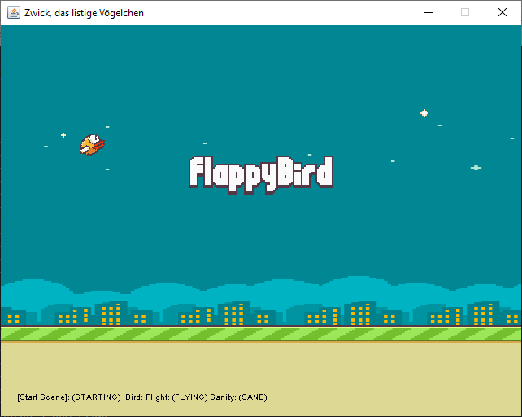

# Birdy
A Flappy-Bird like game using explicit finite state machines.



## How to build and run
```
cd /path/to/BirdyGame
mvn clean install assembly:single
java -jar target\BirdyGame-1.0-jar-with-dependencies.jar
```
## Sample state machine usage

```java
private class FlightControl extends StateMachine<FlightState, BirdEvent> {

  public FlightControl() {
    super(FlightState.class, EventMatchStrategy.BY_EQUALITY);
    setMissingTransitionBehavior(MissingTransitionBehavior.LOG);
    //@formatter:off
    beginStateMachine()
      .description("[Flight]")
      .initialState(FLYING)

    .states()

      .state(FLYING).onTick(() -> {
        if (Keyboard.keyDown(app().settings().get("jump-key"))) {
          flap();
        } else {
          fly();
        }
      })

      .state(CRASHING)
        .onEntry(() -> turnDown())
        .onTick(() -> fall(3))

      .state(DOWN)
        .onEntry(() -> {
          Assets.sound("sfx/die.mp3").play();
          turnDown();
        })

    .transitions()

        .when(FLYING).then(CRASHING).on(TOUCHED_PIPE)
        .when(FLYING).then(CRASHING).on(CRASHED)
        .when(FLYING).then(CRASHING).on(LEFT_WORLD)
        .when(FLYING).then(DOWN).on(TOUCHED_GROUND)

        .when(CRASHING).then(DOWN).on(TOUCHED_GROUND)

    .endStateMachine();
    //@formatter:off
  }
}
```
