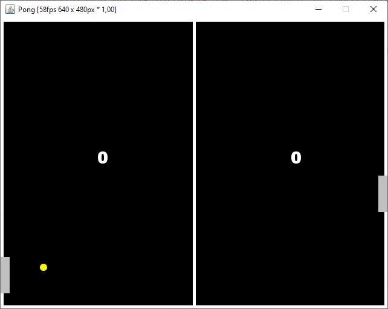

# Pong

Pong game (using finite state machine)



The game controller:
```java
StateMachine.beginStateMachine(PlayState.class, Object.class)
	.description("Pong")	
	.initialState(INIT)

.states()
	.state(INIT).onEntry(this::initEntities)
	.state(SERVING).timeoutAfter(() -> app().clock.sec(2)).onEntry(this::prepareService)
	.state(PLAYING).onTick(this::updateEntities)
	.state(GAME_OVER)

.transitions()
	.when(INIT).then(SERVING).act(this::resetScores)
	.when(SERVING).then(PLAYING).onTimeout().act(this::serveBall)
	.stay(PLAYING).condition(this::leftPaddleHitsBall).act(this::returnBallWithLeftPaddle)
	.stay(PLAYING).condition(this::rightPaddleHitsBall).act(this::returnBallWithRightPaddle)
	.when(PLAYING).then(SERVING).condition(this::isBallOutLeft).act(this::assignPointToRightPlayer)
	.when(PLAYING).then(SERVING).condition(this::isBallOutRight).act(this::assignPointToLeftPlayer)
	.when(PLAYING).then(GAME_OVER).condition(() -> leftPlayerWins() || rightPlayerWins())
	.when(GAME_OVER).then(INIT).condition(() -> Keyboard.keyPressedOnce(KeyEvent.VK_SPACE))

.endStateMachine();
```
